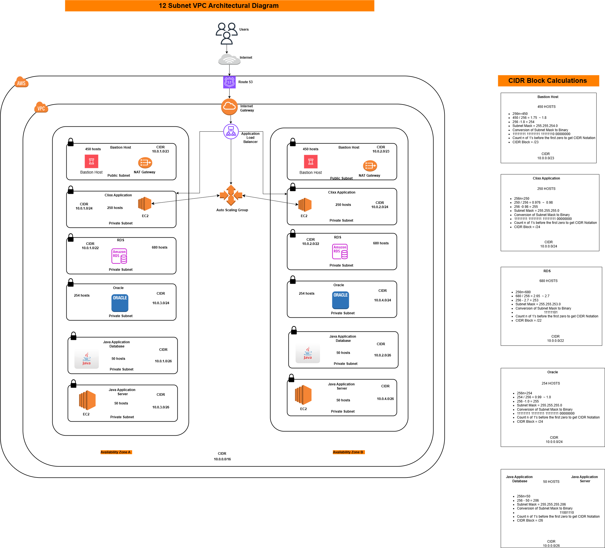

# AWS Infrastructure as Code

Production Terraform code managing multi-component AWS infrastructure across development, staging, and production environments.

## Overview

This repository contains the complete infrastructure-as-code for deploying web applications, CI/CD pipelines, and backend services on AWS. The architecture emphasizes security, high availability, and cost optimization.

**Repository Stats:**
- 69 commits across 27 branches
- 4 major infrastructure components
- Multi-environment deployment support
- Remote state management with S3 and DynamoDB

## Architecture

The infrastructure is organized into four main components:

**BLOG** - Jenkins CI/CD pipeline infrastructure
**CLIXX** - Primary application stack with 12-subnet VPC architecture
**IAM** - Identity and access management for all services
**S3** - Object storage, static assets, and Terraform state backend

## Project Structure

```
STACK_TERRAFORM/
├── BLOG/
│   ├── jenkinsfile
│   ├── backend.tf
│   ├── main.tf
│   ├── providers.tf
│   ├── user_data.sh
│   └── environments/
│
├── CLIXX/
│   ├── main.tf
│   ├── network.tf
│   ├── backend.tf
│   ├── bootstrap.sh
│   ├── jenkinsfile
│   ├── datasources.tf
│   └── environments/
│
├── IAM/
│   ├── stack-iam.tf
│   ├── provider.tf
│   └── terraform.tfstate
│
└── S3/
    ├── provider.tf
    ├── stack_s3.tf
    ├── terraform.tfstate
    └── website_html_objects.tf
```

## Infrastructure Components

### CLIXX Application Stack

The primary application infrastructure featuring a sophisticated 12-subnet VPC design for multi-tier, multi-database workloads:

*12-subnet VPC architecture spanning 2 availability zones with separated tiers for applications, MySQL, Oracle, and Java workloads*

**Network Architecture:**
- 12 subnets across 2 availability zones (us-east-1a, us-east-1b)
- 2 public subnets for Application Load Balancers and bastion hosts
- 10 private subnets organized into 5 tiers:
  - Application tier (2 subnets) - Primary application servers
  - MySQL Database tier (2 subnets) - MySQL RDS instances
  - Oracle Database tier (2 subnets) - Oracle RDS instances
  - Java Database tier (2 subnets) - Java-specific database workloads
  - Java Application tier (2 subnets) - Java application servers
- NAT Gateway in public subnet for private subnet internet access
- Internet Gateway for public subnet routing
- Separate route tables for public and private subnets
- Network ACLs and security groups for defense in depth

**Compute & Storage:**
- EC2 instances running on Amazon Linux 2
- Auto Scaling Groups with health checks
- Application Load Balancer with target group routing
- Multi-AZ RDS deployments (MySQL and Oracle)
- CloudWatch monitoring and alerting

**Deployment:**
- Golden AMI integration for consistent instance provisioning
- Jenkins pipeline for automated deployments
- Zero-downtime rolling updates

### BLOG Infrastructure

Jenkins server infrastructure for CI/CD automation:

- EC2 instance running Jenkins
- S3 backend for build artifacts
- IAM roles for GitHub and AWS service integration
- Security groups restricting access to necessary ports
- User data script for automated Jenkins configuration

### IAM Configuration

Centralized identity and access management:

- Service roles for EC2, Lambda, and other AWS services
- Cross-account access roles for multi-account deployments
- Least-privilege policies following AWS best practices
- Assume role policies with MFA enforcement where required

### S3 Resources

Object storage configuration:

- Terraform state bucket with versioning enabled
- Static website hosting buckets
- Lifecycle policies for cost optimization
- Server-side encryption for all buckets
- Access logging for audit compliance

## State Management

All Terraform state is stored remotely in S3 with DynamoDB state locking:

```hcl
terraform {
  backend "s3" {
    bucket         = "terraform-state-bucket"
    key            = "production/terraform.tfstate"
    region         = "us-east-1"
    encrypt        = true
    dynamodb_table = "terraform-state-lock"
  }
}
```

This configuration ensures:
- State file encryption at rest
- Concurrent access protection via locking
- State history through S3 versioning
- Team collaboration support

## Security Practices

**No Hardcoded Credentials:**
All sensitive data is managed through AWS Systems Manager Parameter Store or Secrets Manager. The commit history shows proper secrets management (e.g., "Remove db_password from Git, use SSM instead").

**IAM Best Practices:**
- Roles over users for service authentication
- Least-privilege access policies
- Regular policy audits and refinements
- CloudTrail logging for all IAM activity

**Network Security:**
- Private subnets for application and data tiers
- NAT Gateways (not NAT instances) for better reliability
- Security groups with minimal required access
- Network ACLs as secondary firewall layer

## Deployment

### Prerequisites

- Terraform 1.5 or later
- AWS CLI configured with appropriate credentials
- Access to target AWS accounts

### Deploy Infrastructure

```bash
# Initialize Terraform
terraform init

# Validate configuration
terraform validate

# Preview changes
terraform plan -var-file="environments/dev.tfvars"

# Apply changes
terraform apply -var-file="environments/dev.tfvars"
```

### Deploy Specific Component

```bash
cd CLIXX/
terraform init
terraform plan
terraform apply
```

### Multi-Environment Management

```bash
# Create and select workspace
terraform workspace new production
terraform workspace select production

# Deploy to selected environment
terraform apply -var-file="environments/production.tfvars"
```

## Development Workflow

1. Create feature branch from dev
2. Make infrastructure changes
3. Run terraform validate and terraform plan
4. Commit with descriptive message
5. Create pull request for review
6. Merge to dev, test in development environment
7. Promote to staging, then production

## Key Learnings

**Terraform State Management:**
- Remote state is essential for team collaboration
- State locking prevents concurrent modification issues
- S3 versioning enables rollback to previous states

**AWS Architecture:**
- 12-subnet design provides clear separation between tiers
- Multi-AZ deployment is critical for high availability
- NAT Gateways are worth the cost vs NAT instances

**Security:**
- Never commit secrets to version control
- Use IAM roles instead of access keys wherever possible
- Implement defense in depth with multiple security layers

## Recent Improvements

Based on commit history:
- Added 12-subnet architecture and golden AMI integration
- Implemented NAT Gateway for private subnet internet access
- Migrated secrets from hardcoded values to SSM Parameter Store
- Simplified Jenkins pipeline configuration
- Moved DynamoDB state lock table to automation account

## Future Enhancements

- Implement automated testing with Terratest
- Add drift detection and remediation
- Expand to multi-region deployment
- Integrate with Terraform Cloud for remote operations
- Add cost estimation in CI/CD pipeline

## Author

**Enoch Farodoye**

LinkedIn: [linkedin.com/in/enoch-farodoye](https://linkedin.com/in/enoch-farodoye)

Email: farodoyeenoch1@gmail.com

---

This infrastructure supports production workloads and follows AWS Well-Architected Framework principles. All code is actively maintained and regularly updated based on evolving requirements and AWS best practices.
